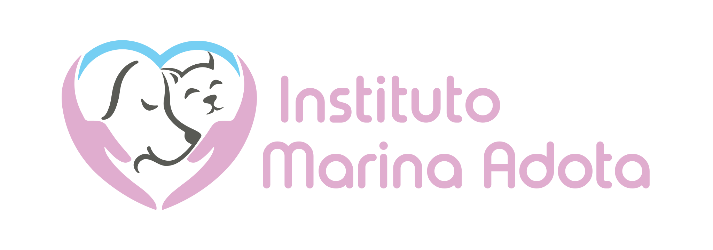

# Projeto Marina Adota

Este é o repositório do projeto Marina Adota, um website estático desenvolvido com o objetivo de promover a adoção de animais e conscientizar sobre a importância da causa. O website pode ser acessado em: [https://marinaadota.com.br](https://marinaadota.com.br).

## Desenvolvedores

Os desenvolvedores que contribuíram para tornar este projeto uma realidade são:

- [Fabiano Nunesmaia](https://github.com/gilnunesmaia)
- [Jéssica Catarino](https://github.com/jessicatarino)

Agradecemos a todos os desenvolvedores que participaram do desenvolvimento no Bitbucket e também ao GitHub por fornecer o serviço de hospedagem dos arquivos estáticos através do GitHub Pages.

## Como Contribuir

Como esse repositório é dedicado apenas aos arquivos estáticos do website, não aceitamos contribuições diretas aqui. No entanto, se você está interessado em ajudar no desenvolvimento do projeto Marina Adota, entre em contato com a equipe através do Instagram para obter mais informações sobre como participar.

## Licença

O conteúdo e o código fonte do projeto Marina Adota estão protegidos sob a licença específica definida no repositório Bitbucket. Para informações detalhadas sobre a licença, consulte o arquivo LICENSE no repositório principal.

## Contato

Para entrar em contato com a equipe responsável pelo projeto Marina Adota, você pode enviar um e-mail para marinaadota.ti@gmail.com ou direct do Instagram.

Siga-nos nas redes sociais:

- [Instagram](https://www.instagram.com/marinaadota)

Se você gostou do projeto e deseja apoiar a causa, considere compartilhar nosso website e nossas redes sociais para alcançarmos mais pessoas interessadas na adoção responsável de animais.

Agradecemos a todos os desenvolvedores que contribuíram para o projeto e aos nossos apoiadores!
